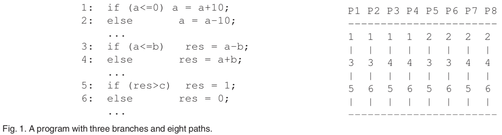

* content
{:toc}


# 2019-02-28-Eliminating-Path-Redundancy-via-Postconditioned-Symbolic-Execution

*Eliminating Path Redundancy via Postconditioned Symbolic Execution, TES'2018*

## Abstract

* **问题：**符号执行受到路径爆炸（path explosion）的限制，因为程序的路径数量可以是执行期间遇到的分支条件的数量的指数级别。

* **贡献：**我们提出了一种称为后处理符号执行（PSE）的新冗余删除方法。

  在每个分支位置，除了确定特定分支在传统符号执行中是否可行之外，还检查分支是否被先前的探索所包含。这是通过最弱的前提条件（WP）计算总结先前探索的路径来实现的。

  后处理符号执行可以识别多个运行路径共享的路径后缀，当它们冗余时在测试生成期间消除它们。修剪掉这些冗余路径可能导致探索路径数量的潜在指数减少。

  由于新方法的计算成本很高，我们还提出了几种启发式方法来降低其成本。

* **论证：**我们在符号执行引擎KLEE中实现了我们的方法，并对GNU Coreutils套件中的大量程序进行了实验。

  我们的结果证实，由于共同路径后缀导致的冗余在实际应用中既丰富又广泛。

  

## 1 INTRODUCTION

由于其在本地执行环境中处理实际应用程序的能力，动态符号执行在实际环境中非常成功 — 对于相关工具的概述，请参阅Pasareanu等人。【[1](http://ix.cs.uoregon.edu/~michal/cis507/PasareanuVisser-SurveyNewTrendsSymbolicExecution.pdf)】

阻止符号执行得到更广泛应用的一个主要障碍是路径爆炸。即，程序的路径数量可以是执行期间遇到的分支条件数量的指数。即使对于中等规模的程序和小范围执行深度，详尽地覆盖所有可能的路径也是非常昂贵的。

### 示例

考虑图1中的程序，它有三个输入变量a，b，c和三个连续的if-else语句。

动态符号执行能够计算一组测试输入，每个测试输入都具有所有输入变量的具体值，以详尽地覆盖程序的有效执行路径。这个程序有2^3 = 8个不同的执行路径。经典的符号执行工具（如KLEE ）将生成8个测试输入。

本例的覆盖路径编号为1到8，如图1（右）所示。例如，P1是通过第1行的if-branch，第3行的if-branch和第5行的if-branch的路径。



---

目前已经有许多工作来缓解路径爆炸问题。其中一个在实践中非常有效，被称为预处理符号执行。除了被测程序之外，它还通过将预定义约束$\prod_{prec}$作为附加参数来实现路径减少。预处理符号执行仅执行满足$\prod_{prec}$的程序分支，具有修剪掉不符合条件的后续分支的实际效果。

通过利用约束，预处理符号执行有效地减少了搜索空间。即，通过牺牲符号执行的完整性来实现路径减少。例如，通过将$\prod_{prec}​$设置为false，预处理符号执行终止而不探索任何路径。

---

在本文中，假设所有潜在的错误都被建模为条件中止语句，我们提出了一种称为后处理符号执行的新方法，它可以**在不减少搜索空间的情况下消除冗余路径**。新方法通过识别并消除符号执行期间遇到的冗余路径后缀来减轻路径爆炸。

我们的方法是基于观察到不同的测试运行之间共享许多路径后缀，反复探索这些路径后缀是路径爆炸的主要原因。

再次考虑图1。尽管图1中的八条路径不同，但它们共享共同的路径后缀。例如，后缀 $\cdots\to$ 3 $\to$ 5路径，由1号和5号路径共用；而后缀$\cdots\to$6路径由2号，4号，6号和8号路径共享。当然，共享后缀并不一定意味着不需要再次探索。否则，路径探索将被错误地减少为分支覆盖。另一方面，由于测试的目的是发现错误（bugs），一旦路径后缀不会显示任何新的程序行为，我们不应该再次探索它。

---

为了避免不必要的探索，后处理符号执行将每个程序位置`l`与后置条件相关联，后置条件总结了从`l`开始的探索路径后缀。

在迭代测试生成过程中，新路径后缀被表征并递增地添加到后置条件，表示为**无量化的一阶逻辑约束**。

在随后的新测试输入计算中，我们的方法检查当前路径条件是否被后置条件包含。如果答案是肯定的，则跳过其余路径的执行。

---

预处理和后处理的符号执行之间存在重大差异。前一种方法的约束是预定义的，而后者的约束是动态计算的。

预先进行符号执行的目标是避免不满足预定义约束的路径，因此不能保证详尽的路径覆盖。实际上，如果预定义约束为false，则不会探索任何路径。它必须谨慎选择预定义约束，否则将无效。

相反，后置符号执行具有等效于标准符号执行的路径覆盖，因为动态计算的后置条件仅消除冗余路径。

---

我们已经实现了一个基于KLEE符号虚拟机的软件工具，并使用GNU Coreutils套件中的大量C程序对其进行评估，该套件实现了一些最常用的Unix/Linux命令。这些基准可以被视为Unix/Linux中系统代码的代表。由于广泛使用错误检查代码，循环，指针和堆分配的数据结构，它们对于符号执行具有挑战性。

尽管如此，我们的实验表明，在这些基准测试中，后期符号执行可以比KLEE中最先进的方法具有显着的加速。

---

综上所述，我们的主要贡献如下：

* 我们提出了一种新的符号执行方法，用于识别和消除冗余路径后缀，以减轻路径爆炸问题。
* 后处理符号执行在计算上开销大的。我们提出了几种启发式优化方法来降低其成本。
* 我们实现了一个基于KLEE的原型软件工具，并通过实验比较我们的新方法和最先进的技术。
* 我们通过对实际应用的实验分析证实，由于公共路径后缀导致的冗余既丰富又广泛，我们的新方法可有效减少探索路径的数量以及执行时间。

---

本文的其余部分安排如下。

我们首先在第2节中建立符号含义并回顾相关技术。

然后，我们在第3节中介绍了后处理符号执行方法，并在第4节中介绍了几个优化，然后是第5节中的实验结果。

我们在第6节中查看相关工作，最后在第7节中给出我们的结论。


## REVIEW OF TEST GENERATION USING SYMBOLIC EXECUTION

……

## 3 POSTCONDITIONED SYMBOLIC EXECUTION

### 3.1 A Motivating Example

后处理符号执行（PSE）尝试通过消除符号执行期间遇到的冗余路径后缀来修剪路径。

在探索过程中，PSE保持与标准符号执行相同的具体和符号状态。此外，在每个分支位置`l`，后置条件$\prod_{post}[l]​$总结了从该位置探索的路径后缀。

给定路径条件为$\phi​$的新路径达到`l`，如果$\phi​$被$\prod_{post}[l]​$包含，则无需继续执行`l`后的路径。包含表示路径到达`l`后，程序沿$\pi​$执行不会导致中止。

为了获得后置条件，我们利用wp计算。在新路径探索之后更新每个分支位置的后置条件。

---

在本节中，我们使用示例说明了PSE背后的主要思想。使用表1中显示的信息，我们首先展示标准符号执行的工作原理。然后，我们展示后处理符号执行如何在同一个例子上工作。


第1-4列说明了在图1中的程序上运行标准符号执行的过程。

第1列显示了路径的索引（编号从1到8）。第2列显示了路径采用的分支序列。第3列显示了在每个分支处通过符号执行累积的路径条件。第4列显示在哪一步调用约束求解器以检查路径条件的可满足性（SAT），以计算测试输入。

第5-7列说明了我们的新方法。第7列显示了在此路径的执行终止后，为每个if-else语句计算的探索路径后缀的摘要。与第3列中显示的原始路径条件$\phi$相反，第5列中的新路径条件$\phi^{'}$是$\phi$与否定的后置条件$\not\prod_{post}[l]$的结合。$\prod_{post}[l]$ 总结了位置`l`开始的所有探索路径后缀，因此$\phi\bigwedge\not\prod_{post}[l]$表示接下来的路径探索将避免这些探索过的路径后缀。值得指出的是后置条件$\prod_{post}[l]$在前一个符号执行路径的末尾计算。

```c

```

